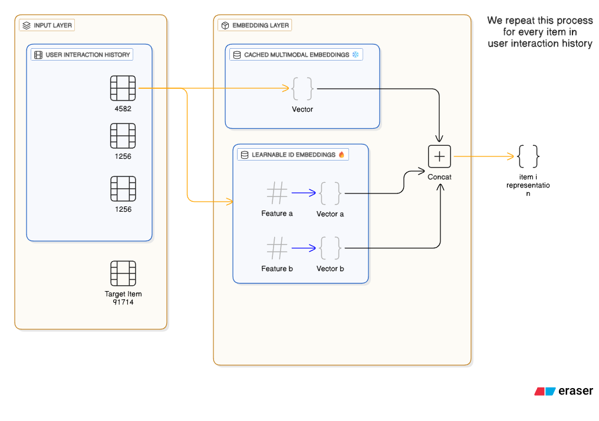
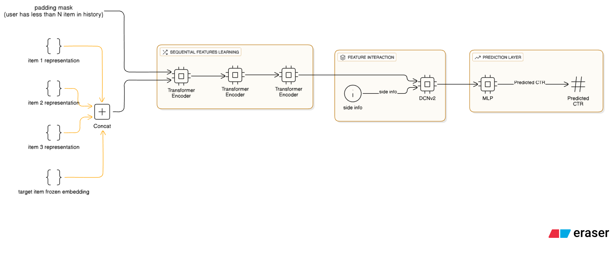

# MMCTR - Multimodal Click-Through Rate Prediction
[](https://pytorch.org/)
[](https://pandas.pydata.org/)
[](https://numpy.org/)
[](https://huggingface.co/docs/transformers)
[](https://huggingface.co/docs/peft/index)
[](https://en.wikipedia.org/wiki/Contrastive_learning)
[](https://en.wikipedia.org/wiki/Multimodal_learning)

This project implements a state-of-the-art CTR prediction system for the WWW2025 MMCTR Challenge using the MicroLens_1M dataset. The solution combines multimodal embeddings (CLIP), contrastive fine-tuning, and a hybrid Transformer-DCN architecture to achieve high prediction accuracy.

**Key Achievements:**
- Best validation AUC: **0.91**
- Test AUC on codabench: **0.92**

## Acknowledgements

This project is based on the model architecture from 
[pinskyrobin/WWW2025_MMCTR](https://github.com/pinskyrobin/WWW2025_MMCTR).
We modified the original architecture by changing the number of layers in the transfomer and DCNv2, and added our proper feature extraction phase.


## Architecture

### 1. Feature Extraction Pipeline


The feature extraction uses **CLIP-ViT-H-14** (laion/CLIP-ViT-H-14-laion2B-s32B-b79K) to generate multimodal embeddings:
- **Image Encoding**: 1024-dimensional image embeddings
- **Text Encoding**: 1024-dimensional text embeddings from item titles
- **Concatenation**: Combined 2048-dimensional CLIP vectors
- **Dimensionality Reduction**: MLP projector reduces to 128 dimensions

### 2. Embedding Layer Architecture


The embedding layer processes:
- **User Interaction History**: Sequential item ids (4582, 1256, 1256)
- **Cached Multimodal Embeddings**: Pre-computed 128D vectors
- **Learnable ID Embeddings**: Trainable feature embeddings
- **Target Item**: Final Item representation
- Process repeats for every item in user interaction history

### 3. Transformer-DCN Model


The main prediction model combines:
- **Sequential Features Learning**: 3-layer Transformer encoder with 4 attention heads
- **Feature Interaction**: DCNv2 (Deep Cross Network v2) for explicit feature crossing
- **Prediction Layer**: MLP for final CTR prediction
- **Padding Handling**: Intelligent masking for variable-length sequences

## Dataset Structure

### Training Data Columns
```
train_columns = ['user_id', 'item_seq', 'item_id', 'likes_level', 'views_level', 'label']
test_columns = ['user_id', 'item_seq', 'item_id', 'likes_level', 'views_level', 'label']
valid_columns = ['user_id', 'item_seq', 'item_id', 'likes_level', 'views_level', 'label']
```

### Item Feature Columns
```
item_feature_columns = [
    'item_id', 'item_title', 'item_tags', 'likes_level', 'views_level',
    'txt_emb_BERT', 'img_emb_CLIPRN50'
]
```

### Item Info & Embeddings
```
item_info_columns = ['item_id', 'item_tags', 'item_emb_d128']
item_emb_columns = [
    'item_id', 'item_emb_d128_v1', 'item_emb_d128_v2',
    'item_emb_d128_v3', 'item_emb_d128_e4'
]
```

## Pipeline

### Phase 1: Multimodal Embedding Generation
1. Load item images and titles
2. Process through CLIP-ViT-H model
3. Extract 1024D image + 1024D text features
4. Concatenate to 2048D vectors
5. Save as `item_emb_clip_large_full.parquet`

**Features:**
- GPU-optimized batch processing
- Checkpoint/resume capability every 5000 items
- Multi-GPU support via DataParallel

### Phase 2: Contrastive Fine-Tuning
1. Load 2048D CLIP embeddings
3. Train MLP projector using triplet loss
4. Optimize for 128D discriminative embeddings

**Training Details:**
- **Loss**: Triplet Margin Loss (margin=1.0)
- **Optimizer**: Adam (lr=1e-3)
- **Batch Size**: 2048
- **History Window**: 5 items
- **Epochs**: 10 with learning rate scheduling

### Phase 3: 128D Embedding Generation
1. Load trained projector weights
2. Process all 2048D vectors through trained MLP
4. Generate final `item_emb_d128.parquet`

### Phase 4: CTR Model Training
1. Integrate 128D embeddings into item_info
2. Configure Transformer-DCN model
3. Train on 3.6M samples with validation
4. Save best model based on AUC metric

## Model Configuration

### Complete Architecture Specifications

#### 1. Contrastive Fine-Tuning Projector (Phase 2)
```python
GPUProjectionNetwork:
    Input Dimension: 2048 (concatenated CLIP image + text)
    Hidden Dimension: 512
    Output Dimension: 128
    
    Architecture:
        Linear(2048 → 512)
        BatchNorm1d(512)
        ReLU()
        Dropout(0.2)
        Linear(512 → 128)
        L2 Normalization
    
    Training:
        Loss: TripletMarginLoss(margin=1.0, p=2)
        Optimizer: Adam(lr=1e-3)
        Batch Size: 2048
        Epochs: 10
        History Window: 5 items
        Padding Index: 0 (frozen)
```

#### 2. Transformer-DCN CTR Model (Phase 4)

**Feature Embedding Layer:**
```python
FeatureEmbedding:
    embedding_dim: 64 (default for categorical features)
    
    Feature Specifications:
        - likes_level: vocab_size=11, emb_dim=64
        - views_level: vocab_size=11, emb_dim=64
        - item_id: vocab_size=91,718, emb_dim=64
        - item_tags: vocab_size=11,740, max_len=5, emb_dim=64
        - item_emb_d128: embedding_dim=128 (pre-computed, frozen)
    
    Item Info Dimension: Varies per item features
    Transformer Input: item_info_dim × 2 (concat with target)
```

**Transformer Encoder:**
```python
Transformer:
    d_model: item_info_dim × 2 (dynamic based on features)
    nhead: 4 (attention heads)
    dim_feedforward: 512
    dropout: 0.1
    num_layers: 3
    batch_first: True
    
    Sequence Processing:
        first_k_cols: 16 (last 16 items from history)
        concat_max_pool: True
        output_dim: (16 + 1) × (item_info_dim × 2)
        
    Output Linear (if max pooling):
        Linear(transformer_in_dim → transformer_in_dim)
```

**Deep Cross Network v2 (DCNv2):**
```python
CrossNetV2:
    input_dim: feature_map.sum_emb_out_dim() + seq_out_dim
    num_layers: 3 (cross layers)
    
    Purpose: Explicit high-order feature interactions
    Output: Same dimension as input
```

**Parallel Deep Neural Network:**
```python
Parallel_DNN (MLP_Block):
    input_dim: Same as CrossNetV2 input
    hidden_units: [512, 256, 128]
    hidden_activations: ReLU
    dropout_rates: 0.2 (applied to each layer)
    batch_norm: True
    output_activation: None (outputs hidden layer)
    
    Architecture:
        Linear(input_dim → 512) + BatchNorm + ReLU + Dropout(0.2)
        Linear(512 → 256) + BatchNorm + ReLU + Dropout(0.2)
        Linear(256 → 128) + BatchNorm + ReLU + Dropout(0.2)
```

**Final Prediction MLP:**
```python
Final_MLP (MLP_Block):
    input_dim: dcn_in_dim + 128 (concat CrossNet + DNN outputs)
    hidden_units: [64, 32]
    output_dim: 1 (CTR prediction)
    hidden_activations: ReLU
    output_activation: Sigmoid (binary classification)
    dropout_rates: 0.2
    batch_norm: True
    
    Architecture:
        Linear(input_dim → 64) + BatchNorm + ReLU + Dropout(0.2)
        Linear(64 → 32) + BatchNorm + ReLU + Dropout(0.2)
        Linear(32 → 1) + Sigmoid
```

**Training Configuration:**
```python
Training:
    Optimizer: Adam
    Learning Rate: 0.0005 (initial)
    LR Schedule: ReduceLROnPlateau
        - factor: 0.1
        - patience: 1 epoch
        - Reductions: 0.0005 → 0.00005 → 0.000005 → 0.000001
    
    Loss: BinaryCrossEntropy
    Batch Size: 1024
    Epochs: 15 (with early stopping)
    Early Stop Patience: 5 epochs
    Monitor: Validation AUC (maximize)
    
    Gradient Clipping: Enabled (max_gradient_norm)
    Accumulation Steps: 1
    
    Regularization:
        embedding_regularizer: 0
        net_regularizer: 0
```
#
